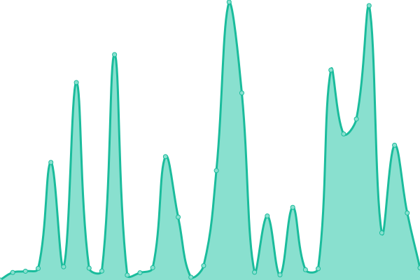
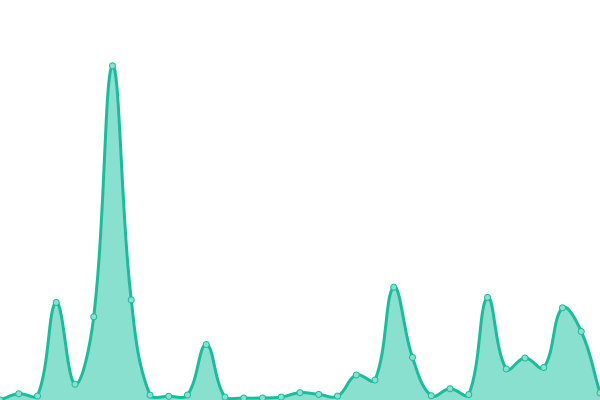

# [📈 Live Status](https://Xiija.github.io/UpMonitor): <!--live status--> **🟧 Partial outage**

[**Visit the UpMonitor status page →**](https://Xiija.github.io/UpMonitor)  
[**Github Marketplace →**](https://github.com/marketplace) 
[**Get your own FREE status monitor →**](https://upptime.js.org/docs/get-started/)

 <!-- <a href="https://Xiija.github.io/UpMonitor" target="_blank" rel="noopener">**Visit the UpMonitor status page →**</a> -->

</img> ...badge made here... [**BadgeMaker**](https://codepen.io/TikiHead/full/BaaqbKg)    
Open-source uptime monitor and status page for [Xiija](https://Xiija.github.io/UpMonitor), powered by [Upptime](https://github.com/upptime/upptime).

<!--start: status pages-->
<!-- This summary is generated by Upptime (https://github.com/upptime/upptime) -->
<!-- Do not edit this manually, your changes will be overwritten -->
<!-- prettier-ignore -->
| URL | Status | History | Response Time | Uptime |
| --- | ------ | ------- | ------------- | ------ |
|  [Bolo](https://Bolo.tikihed.repl.co) | 🟩 Up | [bolo.yml](https://github.com/Xiija/UpMonitor/commits/HEAD/history/bolo.yml) | 

 3015ms
     
 | 

<a href="https://Xiija.github.io/UpMonitor/history/bolo">97.97%</a>
    

|  [Dr.Klahn](https://Dr-Klahn.tikihed.repl.co) | 🟩 Up | [dr-klahn.yml](https://github.com/Xiija/UpMonitor/commits/HEAD/history/dr-klahn.yml) | 

 1843ms
     
 | 

<a href="https://Xiija.github.io/UpMonitor/history/dr-klahn">96.65%</a>
    

|  [Zoltar](https://Zoltar-12.tikihed.repl.co) | 🟩 Up | [zoltar.yml](https://github.com/Xiija/UpMonitor/commits/HEAD/history/zoltar.yml) | 

 4842ms
     
 | 

<a href="https://Xiija.github.io/UpMonitor/history/zoltar">91.45%</a>
    

|  [Prometheus](https://Prometheus-1.tikihed.repl.co) | 🟩 Up | [prometheus.yml](https://github.com/Xiija/UpMonitor/commits/HEAD/history/prometheus.yml) | 

 6848ms
     
 | 

<a href="https://Xiija.github.io/UpMonitor/history/prometheus">98.74%</a>
    

|  [DeathBot K](https://DeathBot-K.tikihed.repl.co) | 🟥 Down | [death-bot-k.yml](https://github.com/Xiija/UpMonitor/commits/HEAD/history/death-bot-k.yml) | 

 1785ms
     
 | 

<a href="https://Xiija.github.io/UpMonitor/history/death-bot-k">95.86%</a>
    

|  [SecondLife RDB](https://SecondLife-RDB-1.tikihed.repl.co) | 🟩 Up | [second-life-rdb.yml](https://github.com/Xiija/UpMonitor/commits/HEAD/history/second-life-rdb.yml) | 

 2647ms
     
 | 

<a href="https://Xiija.github.io/UpMonitor/history/second-life-rdb">97.29%</a>
    

|  [ChatLogr](https://http-resp-6-chatLogr-1.tikihed.repl.co) | 🟩 Up | [chat-logr.yml](https://github.com/Xiija/UpMonitor/commits/HEAD/history/chat-logr.yml) | 

 2581ms
     
 | 

<a href="https://Xiija.github.io/UpMonitor/history/chat-logr">83.57%</a>
    

|  [MBOT-4](https://MBOT-4.tikihed.repl.co) | 🟩 Up | [mbot-4.yml](https://github.com/Xiija/UpMonitor/commits/HEAD/history/mbot-4.yml) | 

 2649ms
     
 | 

<a href="https://Xiija.github.io/UpMonitor/history/mbot-4">95.11%</a>
    

<!--end: status pages-->

With [Upptime](https://upptime.js.org), you can get your own unlimited and free uptime monitor and status page,
 
powered entirely by a GitHub repository. 
We use:  
[Issues](https://github.com/Xiija/UpMonitor/issues) as incident reports, 
[Actions](https://github.com/Xiija/UpMonitor/actions) as uptime monitors, 
[Pages](https://Xiija.github.io/UpMonitor) for the status page.

## 📄 License

- Powered by: [Upptime](https://github.com/upptime/upptime)
- Code: [MIT](./LICENSE) © [Xiija](https://Xiija.github.io/UpMonitor)
- Data in the `./history` directory: [Open Database License](https://opendatacommons.org/licenses/odbl/1-0/)
